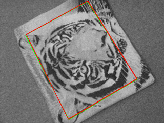

# template_tracking
My Python Implementation of Hyperplane Template Tracking Algorithm, and other Template Matching based Tracking algorithm with a touch of Machine Learning methods.

## Introduction

This repo focuses on simple, straightforward implementations of some Template Matching based Tracking algorithms. Those trackers are good study cases for classic combination of Machine Learning and Computer Vision.

This repo is intended for learning purpose only. For general and high performance purpose, feel free to check: [List of Deep Learning based Tracking Methods](https://github.com/foolwood/benchmark_results).

For more complex and efficient use cases of registration-based tracking methods, please check [MTF](http://webdocs.cs.ualberta.ca/~vis/mtf/index.html).

Some key papers in regards of the implementations:

 - [Real Time Robust Template Matching](https://pdfs.semanticscholar.org/7fbc/4c4f01eb9716959ffef8b4a620a3d1c38577.pdf)
 
 - [Hyperplane Approximation for Template Matching](https://ieeexplore.ieee.org/abstract/document/1017625)

 - [Realtime Registration-Based Tracking via Approximate Nearest Neighbour Search](http://www.roboticsproceedings.org/rss09/p44.pdf)
 

## Requirements
- Python 3.6
- Numpy
- OpenCV
- scikit-learn

## Demo
Some demo results for Hyperplane Template Tracker, red box shows the result from the tracker:

  
  
  
  

## Note
Updates till 6/2/2020: Overall cleaner code structure for hyperplane tracker and minor tracking quality improvement.

Currently, the Hyperplane tracker works with the following conditions:

 - Simply textured planar objects.
 - Minor to no strong reflective surface.
 - Minor to no strong illumination changes.
 - Minor to no occlusions.
 
The implementions to improve the general tracking robustness is ongoing.

## TO-DOs
Some of the to-dos listed here to keep track of implementation progress.

 - [x] Cleaner codebase.

 - [x] Region sampling by grid points.

 - [x] Greedy search and beam search for tracker update.

 - [x] Trajectory visualization.

 - [ ] Multiple sub-templates tracking. (Need to revisit the entire codebase to add sub-templates support, will do so whenever I feel like revisiting this project again :D)